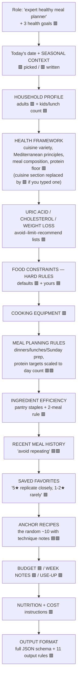
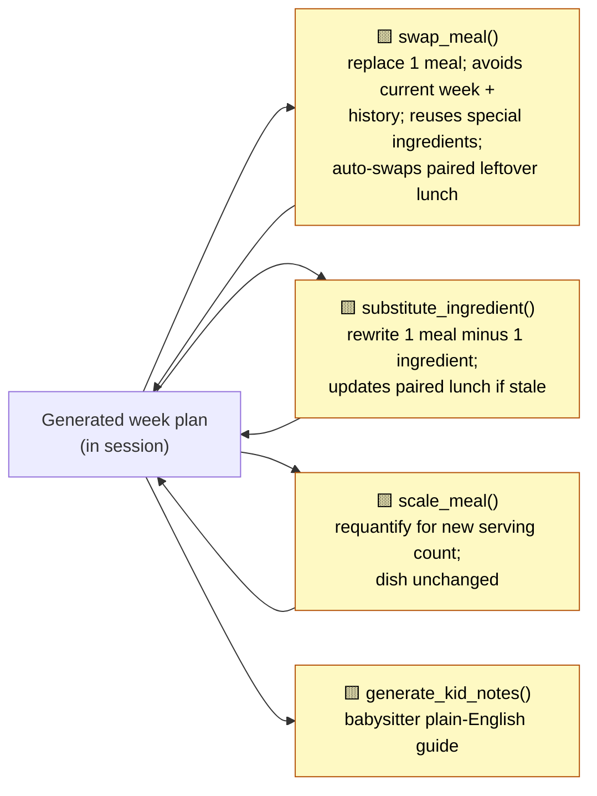

# Meal Plan Generation Pipeline — Visual Flow

**How to view:** GitHub renders these diagrams automatically. Locally, open this file in
VS Code and hit `⇧⌘V` (Markdown preview), or paste a diagram block into
[mermaid.live](https://mermaid.live).

**The color code is the whole point.** Every box is colored by *who makes that decision*,
so when you spot a flaw in a generated week you can trace it to the layer that caused it:

| Color | Layer | Where it lives | How you change it |
|---|---|---|---|
| 🟥 Red | **Hardcoded rules** — predetermined, baked into code | `system_prompt.py` | Edit the Python file |
| 🟦 Blue | **Your data files** — accumulated over time | `data/*.json` | Use the app (Settings/Favorites) or edit the JSON |
| 🟩 Green | **Per-week inputs** — typed fresh each generation | Generate tab UI | Type differently this week |
| 🟪 Purple | **Deterministic Python logic** — same input → same output (except random anchor sampling) | `data_store.py`, `system_prompt.py` | Edit the function |
| 🟨 Yellow | **Claude's judgment** — the only non-deterministic step | The API call | Change what the prompt tells it, or the model/temperature in `meal_planner.py` |

---

## 1. The main flow: button click → week of recipes

```mermaid
flowchart TB
    subgraph INPUTS["📥 INPUTS — what the tool takes in"]
        direction TB
        subgraph HARD["🟥 Hardcoded in system_prompt.py"]
            H1["Health framework<br/>(uric acid / cholesterol / weight-loss rules,<br/>corrected myths, protein targets table)"]
            H2["DEFAULT_CONSTRAINTS<br/>(no mushrooms, no oranges,<br/>no fish in lunches)"]
            H3["PANTRY_STAPLES list<br/>(~75 items)"]
            H4["Atlanta seasonal guidance<br/>(4 canned paragraphs, one per season)"]
            H5["Meal-composition rules<br/>(classic / veg-forward / mezze,<br/>'vegetables are dishes' rule)"]
            H6["Cost guidelines<br/>(Publix/Kroger price anchors)"]
            H7["OUTPUT_SCHEMA<br/>(exact JSON shape Claude must return)"]
        end
        subgraph DATA["🟦 Your data files (data/)"]
            D1["history.json<br/>(past weeks' meal names)"]
            D2["favorites.json<br/>(ratings 1–5, tags, feedback)"]
            D3["constraints.json<br/>(your added food rules)"]
            D4["preferences.json<br/>(kids, lunch count, budget,<br/>portion scale, anchor toggle)"]
            D5["anchor_recipes.json<br/>123 real recipes<br/>(106 mains + 17 sides)<br/>+ anchor_recipes_user.json"]
        end
        subgraph WEEK["🟩 This week's UI inputs"]
            W1["Week notes<br/>('busy week, keep it fast')"]
            W2["Cuisine notes<br/>('one Thai meal')"]
            W3["Ingredients to use up"]
            W4["Days (3–7)"]
        end
    end

    subgraph PROCESS["⚙️ PROCESSING — data_store.py + system_prompt.py"]
        P1["🟪 history_for_prompt()<br/>truncate to last 6 weeks<br/>(12 stored, only 6 sent)"]
        P2["🟪 active_constraints_for_prompt()<br/>keep only 'active' constraints"]
        P3["🟪 select_anchor_recipes()<br/>RANDOM sample ~10 of 123:<br/>~5-6 mains + 1-2 lunch + 2-3 sides<br/>(different every click!)"]
        P4["🟪 get_season(today)<br/>month → season → picks the<br/>matching Atlanta paragraph"]
        P5["🟪 build_system_prompt()<br/>assembles ALL of the above into<br/>one ~5,000-word system prompt.<br/>Kid rules & protein targets adjust<br/>to your prefs; schema mutated to<br/>match kid count & day count"]
    end

    subgraph CLAUDE["🤖 CLAUDE — the only place recipes are invented"]
        C1["🟨 One API call<br/>claude-opus-4-8, temp 1.0, max 16k tokens<br/><br/>Claude decides here:<br/>• which 5 dinners + 5 lunches<br/>• which anchors to adapt vs. ignore<br/>• how to resolve rule tensions<br/>• all quantities, steps, kid adaptations<br/>• nutrition & cost ESTIMATES (not computed —<br/>Claude's judgment, ±15-20%)"]
    end

    subgraph POST["✅ POST-PROCESSING — meal_planner.py + data_store.py"]
        V1["🟪 Parse JSON + _validate_plan()<br/>checks structure (meal counts, kid_adaptation)<br/>+ composition mix (≥2 veg-forward/mezze<br/>dinners per 5-day week).<br/>Does NOT verify other health rules,<br/>constraints, nutrition, or cost"]
        V2["🟪 append_to_history()<br/>this week feeds NEXT week's<br/>'avoid repeating' context"]
        V3["🟪 build_shopping_list()<br/>strips pantry staples, dedupes,<br/>groups by store section"]
        OUT["📄 Week plan rendered:<br/>meal cards, shopping list, PDF"]
    end

    H1 & H2 & H3 & H4 & H5 & H6 & H7 --> P5
    D1 --> P1 --> P5
    D3 --> P2 --> P5
    D5 --> P3 --> P5
    D2 --> P5
    D4 --> P5
    D4 -. "use_anchor_recipes toggle<br/>gates this" .-> P3
    W1 & W2 & W3 & W4 --> P5
    P4 --> P5
    P5 --> C1
    C1 --> V1
    V1 -- "invalid → error, no retry" --> ERR["❌ MealPlanError shown in UI"]
    V1 --> V2
    V1 --> V3
    V1 --> OUT
    V2 -. "loops back as input<br/>next week" .-> D1

    classDef hard fill:#fde2e2,stroke:#c0392b,color:#000
    classDef data fill:#dbeafe,stroke:#1d4ed8,color:#000
    classDef week fill:#dcfce7,stroke:#15803d,color:#000
    classDef logic fill:#ede9fe,stroke:#6d28d9,color:#000
    classDef ai fill:#fef9c3,stroke:#b45309,color:#000
    class H1,H2,H3,H4,H5,H6,H7 hard
    class D1,D2,D3,D4,D5 data
    class W1,W2,W3,W4 week
    class P1,P2,P3,P4,P5,V1,V2,V3 logic
    class C1 ai
```

---

## 2. What the assembled system prompt actually looks like

The prompt Claude receives is one long document. This is its section order — useful because
**earlier ≈ framing, and sections marked HARD RULES carry the most weight**:

---

## 3. After generation: the smaller Claude calls

Each edit action is a **separate, smaller API call** with its own mini-prompt — these do
**not** reuse the big system prompt, they carry a condensed copy of the rules
(`meal_planner.py` → `_SWAP_SYSTEM`, `_SUBSTITUTE_SYSTEM`, `_SCALE_SYSTEM`):

⚠️ **Known asymmetry:** the swap/substitute mini-prompts hardcode a *summary* of the health
rules and constraints. If you add a rule to the main prompt in `system_prompt.py`, the edit
prompts don't automatically get it — a swap can reintroduce something the main generation
correctly avoided.

---

## 4. Troubleshooting map: "I saw a flaw — where do I fix it?"

| Symptom in a generated week | Deciding layer | Go to |
|---|---|---|
| A food you never want keeps appearing | 🟦 Missing constraint | Settings tab → add constraint (or `data/constraints.json`) |
| Health guidance seems wrong/outdated | 🟥 Hardcoded rules | `system_prompt.py` — uric acid / cholesterol / weight-loss sections |
| Meals repeat too soon (or variety feels forced) | 🟥 + 🟪 | The "avoid same protein+grain within 3 weeks" wording in `history_block`; the 6-week window in `data_store.HISTORY_WEEKS_FOR_PROMPT` |
| Weeks feel same-y across a season; anchors never seem used | 🟪 Random sampling only ~10 of 123 anchors per week | `data_store.select_anchor_recipes()` — sample size, pool splits; or the anchor block wording ("adapt freely") |
| Favorites never come back / come back too often | 🟥 wording + 🟦 your ratings | The `favorites_block` instruction ("5★ replicate closely"); your ratings in Favorites tab |
| A staple you don't own goes missing from the shopping list | 🟥 | `PANTRY_STAPLES` in `system_prompt.py` (used both in the prompt and by `shopping.py`'s filter) |
| Wrong equipment / oven meals in August | 🟥 | `season_guidance` dict + COOKING EQUIPMENT section |
| Nutrition or cost numbers look off | 🟨 Claude estimates these, nothing verifies them | Only leverage: cost anchor prices in `cost_block`, or accept ±15-20% |
| Plan violates a hard rule and still gets through | 🟪 Validation gap | `_validate_plan()` checks counts, kid_adaptation, and the composition mix — all other content rules are enforced by prompt alone |
| A swapped meal breaks a rule the original week respected | 🟥 Duplicated rule summaries | `_SWAP_SYSTEM` / `_SUBSTITUTE_SYSTEM` in `meal_planner.py` |
| Whole weeks feel too exotic / too safe | 🟨 | Temperature (default 1.0) and model in `meal_planner.py` |

---

## 5. Three structural takeaways

1. **Claude only invents at one point** (the yellow box), but everything it knows arrives
   through the assembled prompt — so nearly every "Claude decision" is actually steerable
   from a red or blue box upstream.
2. **The randomness you experience week-to-week has two sources:** the random anchor sample
   (🟪 `select_anchor_recipes`) and generation temperature (🟨 1.0). Everything else is
   deterministic.
3. **Almost nothing downstream checks content.** Validation covers structure plus one
   content rule (the vegetable-forward/mezze mix via the `composition` field); the shopping
   list trusts Claude's `pantry_staple` flags (with a name-match backstop). Every other
   health or constraint rule's only enforcement is how forcefully the prompt states it.
